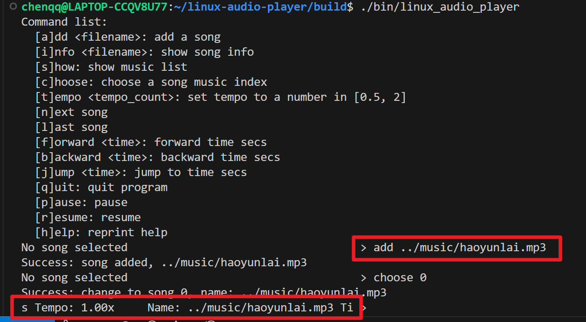

# 基于 Linux ALSA 和 FFmpeg 的音乐解码播放器 —— 嵌入式系统实现

## 组员

软件03 陈启乾 2020012385

软件02 郑琬仪 2020012364

软件02 覃果 2020012379

## 简介

基于 ffmpeg 和 ALSA 实现的 Linux 音频播放器。

## 构建

采用 CMake 和 C++ 构建项目。

编译方法：在项目根文件夹下

```bash
mkdir build
cmake ..
make
```

注：如果需要交叉编译，则需要先配置交叉编译环境，并且开启。

### Host 调试环境依赖

* GNU GCC/G++
* CMake
* ALSA library
* FFmpeg library(`libavfilter, libavcodec, ...`)

可以通过一下命令安装必须依赖：

```bash
sudo apt update
sudo apt install gcc g++ cmake
sudo apt install libasound2-dev libavfilter-dev libavcodec-dev libavformat-dev libswresample-dev libavutil-dev
```

可选依赖：

```bash
sudo apt install alsa-utils ffmpeg
```

### （可选）交叉编译环境

使用脚本配置工具链：

```bash
source /opt/st/myir/3.1-snapshot/environment-setup-cortexa7t2hf-neon-vfpv4-ostl-linux-gnueabi
```

ffmpeg 的交叉编译参见 [ffmpeg.md](ffmpeg.md)。 


## Decoder

### 音频解码

1. 初始化分配packet和frame
```C++
packet = av_packet_alloc();
frame = av_frame_alloc();
```
2. 打开音频文件并获得音频相关信息，包括音频流
```C++
avformat_open_input()
avformat_find_stream_info()
av_find_best_stream() // 寻找音频流
```

3. 初始化音频解码器上下文，并设置解码器参数，打开音频解码器
```C++
avcodec_alloc_context3()
avcodec_parameters_to_context()
avcodec_open2()
```

4. 开始解码，通过循环读取每一帧数据的数据包，当数据包的stream_index符合音频流时，将封装包(解析数据)发送到解码器，再次开启循环获得解码后的数据，对于解码后的数据可以进行其他操作，包括音频过滤和音频格式转换(下文将详细解释)，直到解码结束。

`avcodec_send_packet`和`avcodec_receive_frame`调用关系并不一定是一对一的，比如一些音频数据一个`AVPacket`中包含了1秒钟的音频，调用一次`avcodec_send_packet`之后，可能需要调用25次`avcodec_receive_frame`才能获取全部的解码音频数据，所以要做如下处理：

```C++
while(av_read_frame()) {
    avcodec_send_packet()
    while(avcodec_receive_frame()) {
        // filter 音频过滤处理
        while() {
            // convert 音频格式转换（to PCM）
        }
    }
}
```

### 音频格式转换（to PCM）

主要使用了`libswresample/swresample.h`，主要是用于音频的重采样和格式转换。

1. `AVCodec`中保存了音频信息，其音频文件所需的部分数据结构大概如下，`codec`中为原输入音频，`Outxxx`为为PCM音频格式的指定参数，因此所有ffmpeg支持的音频格式都可以转换为PCM
```C++
const char *name //编解码器的名字，比较短
const char *long_name //编解码器的名字，全称，比较长
enum AVCodecID id //ID，不重复
const int *supported_samplerates //支持的采样率（仅音频）
const enum AVSampleFormat *sample_fmts //支持的采样格式（仅音频）
const uint64_t *channel_layouts //支持的声道数（仅音频）
```

2. 获取音频转码器并设置采样参数初始化
```C++
swr_alloc_set_opts() // 在此处设置输入音频的参数和输出音频的参数
swr_init()
```

3. 获取每个采样点的字节大小，根据PCM的格式修改采样率参数后，重新获取采样点的样本个数，再为为采样点样本分配一个样本缓冲区
```C++
av_get_bytes_per_sample()
av_rescale_rnd()
av_samples_alloc()
```

4. 针对每个数据包中的数据帧进行重采样为目标格式（PCM），采样数据转换，参数为输入、输出采样数据指针及采样数量
```C++
int outChannel = 2;  // 重采样后输出的通道
int outSampleRate = 44100;  // 重采样后输出的采样率
enum AVSampleFormat outFormat = AV_SAMPLE_FMT_S16P; // 重采样后输出的格式

swr_convert()
```

5. PCM音频格式通过采用LRLRLR方式交错存储，当channel=1时就不需要重新读写，PCM帧大小计算（PCM Buffersize=采样率\*采样时间\*采样位数/8\*通道数（Bytes））

```C++
uint8_t output_buffer[numBytes * realOutNbSamples * outChannel];

int cnt = 0;

// 使用 LRLRLRLRLRL（采样点为单位，采样点有几个字节，交替存储到）
for (int index = 0; index < realOutNbSamples; index++) {
    for (int channel = 0; channel < codec_ctx->channels; channel++) {
        for(int i = 0; i < numBytes; i++) {
            output_buffer[cnt++] = buffer[channel][numBytes * index + i];
        }
    }
}
```
### 音频过滤流程（倍速处理）

使用 `libavfilter/avfilter.h`，`libavfilter/buffersink.h` 和 `libavfilter/buffersrc.h`

1. `init_atempo_filter` 函数用于初始化用于变速的filter过滤器
```C++
avfilter_graph_alloc()

// 初始化abuffer，用于接收输入 frame，形成待处理的数据缓存
const AVFilter *abuffer = avfilter_get_by_name("abuffer");
AVFilterContext *abuffer_ctx = avfilter_graph_alloc_filter(graph, abuffer, "src");

// 设置参数：匹配原始音频采样率sample rate，数据格式sample_fmt， channel_layout声道
avfilter_init_str()

// 初始化atempo filter，atempo为变速
const AVFilter *atempo = avfilter_get_by_name("atempo");
AVFilterContext *atempo_ctx = avfilter_graph_alloc_filter(graph, atempo, "atempo");

// 初始化aformat，过滤器约束最终的输出格式（采样率，声道数，存储位数等）
const AVFilter *aformat = avfilter_get_by_name("aformat");
AVFilterContext *aformat_ctx = avfilter_graph_alloc_filter(graph, aformat, "aformat");

// 初始化abuffersink用于输出
const AVFilter *sink = avfilter_get_by_name("abuffersink");
AVFilterContext *sink_ctx = avfilter_graph_alloc_filter(graph, sink, "sink");

// 连接各个filter的上下文: 顺序为abuffer->atempo_ctx->aformat_ctx->sink_ctx
avfilter_link()
```

2. 使用过滤器将解码后的`Frame`加入到输入过滤器上下文`in_ctx`中，通过`av_buffersink_get_frame`获取处理完成的`FrameAudio`，然后再进入音频格式转换。
```C++
av_buffersrc_add_frame()

while(av_buffersink_get_frame()) {
    // 音频格式转换（to PCM）
}
```

### 音频格式输出

采用回调函数的方法，在得到音频格式后调用回调函数，将 buffer 和采样点个数作为参数将数据输出。
```C++
callback(output_buffer, realOutNbSamples);
```

### 解码过程的动态调整

我们通过多线程的方式实现了解码过程中的动态调整，例如可以在播放过程中调整倍速、跳转等。我们会打开一个单独的线程进行解码工作，在主线程中进行控制工作。

主线程通过共享内存模型向解码线程传递信号（如切换倍速、跳转到某时间戳），使用 `std::mutex` 的互斥锁

## Player 类

Player 类调用 ALSA 的接口，将 Decoder 解码得到的 pcm 数据播放出来。

1. 初始化，调用一系列 `snd_` 函数：分配 hw_params 空间（`snd_pcm_hw_params_malloc`），打开 pcm 设备（`snd_pcm_open`），初始化 pcm 配置（`snd_pcm_hw_params_any`），设置 pcm 参数(`snd_pcm_set_params`)

2. 实现了上面提到的回调函数：调用 `snd_pcm_writei` 将解码得到的 pcm 数据输出到声音设备。


## Controller 类

这个类维护了音乐播放器的相关功能。包括：

1. 维护了一个目前选择的歌曲的路径的列表 `std::vector<std::string> song_list;` 以及当前选择的歌曲 `current_selecte_index`

2. 维护了一个 Decoder 和 Player 类，通过回调函数连接 Decoder 的输出和 Player 的输入。

3. 维护了 Decoder 的工作进程

4. 维护了一系列操作的公开接口：修改歌曲列表，切换上/下一首，倍速，快进快退；通过操作 Decoder 的对应接口来完成。


## 主文件

这里通过关掉终端的回显，实现了一个命令行界面：



右侧可以输入命令交互，左侧则显示目前播放歌曲的信息。

## 改进空间

* 更合理的用户交互方式

## 心得体会

cmake 挺好用的。ffmpeg 其实不用编，但不知道为什么虚拟机里没有。箱子没怎么用，落了好多灰。

某位队员的一位室友要在此特别指出，他经过观察我们这一学期的大作业情况，特别感谢老师没有批准他的特殊选课申请，让他免受大作业的摧残。

谢谢老师，谢谢助教！
